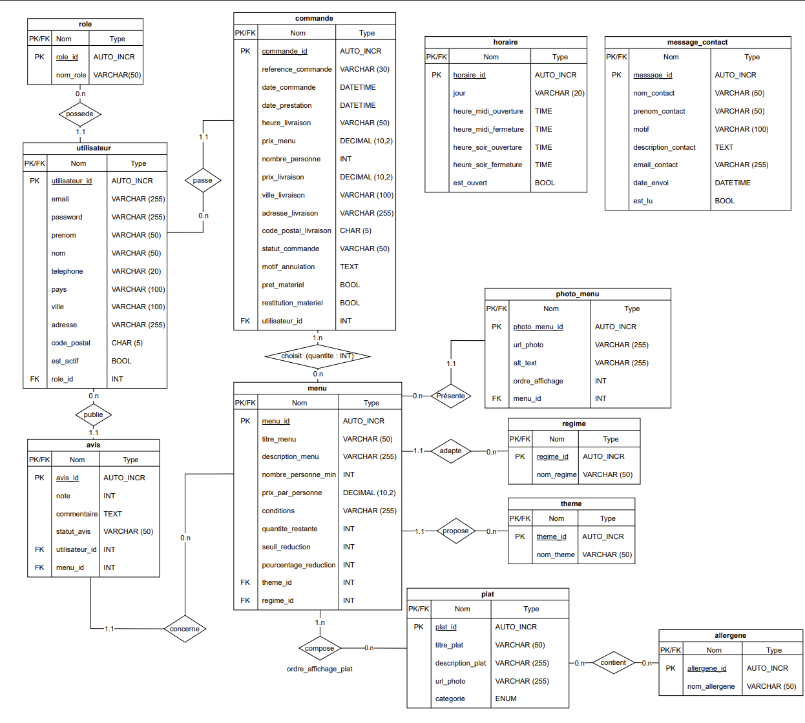

# Vite-Et-Gourmand
Projet réalisé dans le cadre de l'ECF pour le titre de développeur Web. Ce projet couvre l'intégralité du cycle de développement : de la conception (UML/MCD), au design (UI/UX), jusqu'au développement complet du Backend et du Frontend.
1. **Espace Client :** Consultation de la carte, gestion du panier conditionnel (remises automatiques), paiement Stripe, suivi des commandes et dépôt d'avis.
2. **Espace Employé :** Tableau de bord pour la préparation des commandes, la gestion du retour matériel, la modification des stocks/prix, l'ajustement des horaires et la modération des avis.
3. **Espace Administrateur :** Outils de Business Intelligence (statistiques NoSQL) et gestion complète de l'équipe (CRUD du personnel avec envoi d'e-mails RGPD).
# Aperçu du Projet

## Design Desktop & Mobile


<br>


## Documentation Technique
### Conception de la Base de Données (MCD)



- **UML & MCD** : `/docs/conception_technique/`
- **Design & Wireframes** : `/docs/design_maquettes/` et `/docs/wireframes/`

## Stack Technique
- [x] **Conception** : _Draw.io_ (UML/MCD)
- [x] **Design** : _Balsamiq_ (Wireframes)
- [x] **Design** : _Figma_ (Maquettes et charte)
- [x] **Base de données** : _MySQL_ (Structure initiale déployée)
- [X] **Backend** : _Python & Flask_ (Routage dynamique, gestion des sessions et logique métier)
- [X] **Frontend** : _HTML / CSS / Bootstrap / JS_ (Intégration fluide et responsive)
- [X] **E-mails & Test** : _Flask-Mail & Mailtrap_ (Gestion et interception des e-mails transactionnels)
- [X] **NoSQL** : _MongoDB_ (Agrégations et statistiques NoSQL)

### Architecture du Projet
```text
Vite-Et-Gourmand/
├── backend/                  # Logique métier et requêtes SQL (architecture segmentée)
│   ├── admin.py              # CRUD du personnel (création/désactivation) sécurisé
│   ├── admin_data.py         # Moteur ETL (Sync MySQL vers MongoDB) et agrégations NoSQL
│   ├── cart.py               # Algorithmes de calcul des prix et règles des remises du panier
│   ├── database.py           # Configuration de la passerelle de connexion MySQL
│   ├── contact.py            # Traitement et persistance sécurisée en base de données des requêtes du formulaire de contact
│   ├── secure.py             # Utilitaire de sécurité de pré-déploiement : détection, salage et hachage (Bcrypt) des mots de passe dans le script SQL
│   ├── menu.py               # Requêtes d'extraction du catalogue général des menus
│   ├── menu_model.py         # Logique d'affichage dynamique des fiches détails d'un menu
│   ├── order.py              # Enregistrement des commandes en BDD post-paiement Stripe
│   ├── order_history.py      # Traitement et récupération de l'historique d'achats client
│   ├── review.py             # Extraction optimisée (limite et tri) des derniers avis clients validés pour affichage dynamique sur la vitrine
│   ├── employee_order.py     # Gestion logistique : suivi des commandes, mise à jour des statuts et blocage de clôture si le matériel n'est pas restitué
│   ├── schedule.py           # Gestion et affichage dynamique des horaires d'ouverture
│   └── user.py               # Gestion de la sécurité des profils (Bcrypt, sessions et validations)
├── docs/                     # Documentation de conception (MCD, Wireframes, Maquettes)
│   ├── conception_technique/ # Schémas MCD (Draw.io) et documents techniques
│   ├── design_maquettes/     # Exports graphiques des maquettes haute fidélité (Figma)
│   └── wireframes/           # Maquettes fonctionnelles basse fidélité (Balsamiq)
├── frontend/                 # Interface utilisateur et assets graphiques
│   ├── static/               # Assets statiques (Fichiers CSS personnalisés, JS natif et images)
│   └── templates/            # Vues dynamiques gérées par le moteur de rendu Jinja2
│       ├── auth/             # Formulaires d'authentification (Connexion, Inscription, Reset Password)
│       ├── admin/            # Vues exclusives Administrateur (Gestion équipe, dashboard Business Intelligence (chart.js)
│       ├── employee/         # Tableau de bord et vues de gestion pour le personnel
│       ├── emails/           # Gabarits HTML des e-mails transactionnels (Bienvenue, Commande, Contact)
│       ├── cart.html         # Interface de visualisation du panier et choix des options logistiques
│       ├── detail_menu.html  # Fiche détaillée d'un menu avec options et convives dynamiques
│       ├── home.html         # Page d'accueil avec formulaire de contact et avis clients
│       ├── menus.html        # Catalogue général des menus et système de filtres
│       ├── my_orders.html    # Tableau de bord client / Historique des commandes
│       ├── profile.html      # Espace personnel et gestion des coordonnées de livraison
│       └── success.html      # Page de confirmation après validation du paiement Stripe
│       └── legal_notice.html # Page des mentions légales du site 
│       └── gtc.html          # Page des conditions générales de vente (CVG)
├── sql/                      # Scripts d'initialisation de la base de données
│   ├── 01_create_tables.sql  # Script de définition de la structure (tables, contraintes, clés)
│   └── 02_insert_data.sql    # Jeu de données initial (menus, rôles, utilisateurs de test)
├── tests/                    # Scripts d'assurance qualité et tests de contournement sécurité
│   └── test_security.py      # Script de test automatisé face aux contournements de formulaires (inscription)
├── .env                      # Variables d'environnement locales (BDD, clés Stripe, Mailtrap) - [Ignoré par Git]
├── app.py                    # Point d'entrée de l'application Flask, configuration et routage principal
├── README.md                 # Documentation globale du projet
└── requirements.txt          # Liste des dépendances et packages Python requis (Flask, Stripe, Bcrypt...)
```

## Fonctionnalités
* **Fidélité de la Charte Graphique :** 
  * Surcharge CSS des comportements natifs de Google Chrome (`-webkit-autofill`) et de Bootstrap (`:focus`) pour conserver les tons et le style visuel du site en toutes circonstances.
* **Affichage / Masquage dynamique du mot de passe :** 
  * Intégration d'un bouton œil interactif géré en JavaScript natif et stylisé en CSS pour s'intégrer harmonieusement à la charte graphique, facilitant la saisie des mots de passe complexes.
* **Catalogue Dynamique :** 
  * Affichage des menus depuis la base de données avec gestion des stocks en temps réel.
* **Filtres Avancés :** 
  * Recherche multicritères (budget, nombre de convives, thèmes, régimes et allergènes).
* **Tunnel de Commande (Panier) :** 
  * Calcul dynamique des prix selon le nombre de convives.
  * Application automatique de règles métier (ex: seuil de réduction pour commandes volumineuses).
  * Persistance du panier via les sessions Flask.
* **Historique d'Achats Centralisé (Dashboard Client) :**
  * Restitution complète de toutes les commandes passées par l'utilisateur connecté sous forme de cartes d'historique interactives (style accordéon/collapse).
  * Affichage transparent des références de transaction, dates de prestation, adresses associées, détails exacts du contenu commandé (quantités et menus), remises appliquées, frais de livraison et montant total TTC payé.
  * Suivi visuel du statut de traitement de la commande ("En attente de validation", "En cours de préparation", "Livré", "Annulé").
* **Espace Client & Gestion du Profil :** * Formulaire sécurisé permettant à l'utilisateur de modifier ses informations personnelles (nom, prénom, téléphone, adresse de livraison par défaut).
  * Persistance et mise à jour en temps réel des données en base de données avec répercussion immédiate sur la session de navigation.
* **Intégration de Stripe** : Paiement sécurisé par carte bancaire avec transmission des données logistiques (adresse, prêt de matériel) via métadonnées.
* **Notifications E-mails Transactionnels (HTML Custom) :** 
  * **Confirmation de commande** : Envoi automatique d'un récapitulatif détaillé (menus, remises, frais de livraison, adresse et option de prêt de matériel) après validation du paiement Stripe.
  * **E-mail de Bienvenue** : Envoi d'un mot d'accueil personnalisé dès la validation de l'inscription.
  * **Notification Admin** : Alerte par e-mail envoyée automatiquement aux administrateurs (Julie & José) lors de la soumission du formulaire de contact.
* **Tableau de Bord Dynamique (Jinja2) :** 
  * **Interface "Split-Screen" qui s'adapte automatiquement (grille et accès) selon que l'utilisateur est un Employé (rôle 2) ou un Administrateur (rôle 1). Masquage complet des fonctionnalités non autorisées.**
* **Gestion du Personnel (Admin) :**
  * CRUD complet permettant de créer de nouveaux comptes employés (hachage à la volée) et d'activer/désactiver les accès.
* **Business Intelligence (NoSQL) :**
  * Intégration de MongoDB pour séparer les données transactionnelles de l'analytique. 
  * Utilisation de pipelines d'agrégation ($group, $sum, $sort) pour générer des graphiques de performance.
* **Moteur ETL :** 
  * Synchronisation automatisée entre MySQL et MongoDB pour garantir la fraîcheur des statistiques de vente.
* **Visualisation Dynamique :** 
  * Intégration de Chart.js avec une palette de couleurs native (charte V&G) pour l'analyse du volume de ventes et du Chiffre d'Affaires.
## Sécurité Implémentées

Le système d'authentification a été conçu en respectant les standards de sécurité actuels et en optimisant l'expérience utilisateur (UX) :

* **Hachage des mots de passe** : Utilisation de la bibliothèque `Bcrypt` côté backend. Aucun mot de passe n'est stocké en clair en base de données (salage et hachage dynamique).
* **Double validation des formulaires** :
  * **Côté Client** : Validation immédiate en HTML5/JS (Regex pour mot de passe fort, format de téléphone à 10 chiffres, emails valides) pour un retour utilisateur instantané sans rechargement de page.
  * **Côté Serveur** : Double vérification de sécurité en Python (`app.py`) pour bloquer les requêtes malveillantes qui contourneraient le navigateur.
* **Gestion intelligente des doublons** : Avant l'inscription, le backend vérifie l'unicité de l'adresse email. En cas de doublon, un message d'erreur ciblé est affiché directement sur le champ concerné sans recharger ni vider les autres saisies de l'utilisateur (grâce à Jinja2).
* **Réinitialisation sécurisée du mot de passe** : Génération d'un lien de récupération unique envoyé par e-mail. La mise à jour en base de données réutilise le hachage dynamique `Bcrypt`, garantissant l'intégrité du système d'authentification global.
* **Protection des Routes :**
  * Chaque route sensible (panier, back-office, édition) interroge la session de l'utilisateur et son role_id pour autoriser ou rejeter l'accès (HTTP 403 / Redirections).
## Installation et Déploiement Local

* **Prérequis Serveur local :** _Laragon_ (recommandé) ou WAMP/XAMPP.

* **Base de données :** MongoDB (local ou Atlas) et MySQL (Laragon/WAMP).

* **Environnement :**  `Python 3.13`

* **Git :** Clonage du dépôt 

```bash
git clone https://github.com/anthonymulapro-tech/Vite-Et-Gourmand.git
cd Vite-Et-Gourmand
```

#### 1. Configuration de la Base de Données (MySQL)
* a. Ouvrir votre outil de gestion SQL (_HeidiSQL_ ou _phpMyAdmin_ via _Laragon_).
* b. Créer une nouvelle base de données nommée **vite_et_gourmand**.
* c. Importer et exécuter le script de création des tables : `sql/01_create_tables.sql`
* d. Exécuter le script d'insertion des données : `sql/02_insert_data.sql`.
* e. Exécuter le haschage des mots de passes par sécurité : `backend/secure.py`.

### 2. Configuration des variables d'environnement
Dupliquez le fichier `.env.example` à la racine du projet et renommez-le en `.env`, puis ajustez vos accès si nécessaire :
```bash
DB_HOST=127.0.0.1
DB_USER=root
DB_PASSWORD=
DB_NAME=vite_et_gourmand
SECRET_KEY=une_cle_secrete_aleatoire_et_ultra_securisee
STRIPE_PUBLIC_KEY=pk_test_clé_via_stripe
STRIPE_SECRET_KEY=sk_test_clé_via_stripe
MAIL_SERVER=sandbox.smtp.mailtrap.io
MAIL_PORT=2525
MAIL_USERNAME=identifiant_mailtrap
MAIL_PASSWORD=mot_de_passe_mailtrap
MAIL_USE_TLS=True
MAIL_USE_SSL=False
```

#### 3. Configuration du Backend (Python)
* a. Créer un environnement virtuel : 
```bash 
python -m venv .venv
```

* b. Activer l'environnement : 
  * Windows : 
  ```bash 
  .\.venv\Scripts\activate
  ```
  
  * Linux : 
  ```bash
  source .venv/bin/activate
  ```
  
* c. Installer les dépendances : 
```bash
pip install -r requirements.txt
```

### 4. Serveur Flask
* démarrage du serveur : 
```bash
python app.py
```
Le serveur sera disponible en local sur : http://127.0.0.1:5000

### 5. Liens d'accès aux pages
* **Accès pour tout type d'utilisateur**
  * Page d'accueil : http://127.0.0.1:5000/
  * Inscription : http://127.0.0.1:5000/register
  * Connexion : http://127.0.0.1:5000/login
  * Page des menus : http://127.0.0.1:5000/menus
  * Détail des menus : http://127.0.0.1:5000/menu/1 (ou /2 ou /3)
  * Page CVG : http://127.0.0.1:5000/gtc
  * Page des mentions légales : http://127.0.0.1:5000/legal-notice
* **Accès pour client / employé / admin**
  * Mot de passe oublié : http://127.0.0.1:5000/forgot-password
  * Page panier : http://127.0.0.1:5000/cart
  * Page de finalisation de commande : http://127.0.0.1:5000/order-details
  * Page de l'historique des commandes : http://127.0.0.1:5000/my-orders
  * Gestion du profil : http://127.0.0.1:5000/profile
* **Accès employé/admin**
  * Espace personnel avec version employé (#2) et verison admin (#1) : http://127.0.0.1:5000/employee/dashboard
  * Suivis de commande : http://127.0.0.1:5000/employee/orders
  * Modération des avis : http://127.0.0.1:5000/employee/reviews
  * Gestion de la carte : http://127.0.0.1:5000/employee/menu
  * Gestion des horaires : http://127.0.0.1:5000/employee/schedule
* **Accès uniquement admin**
  * Gestion des employées : http://127.0.0.1:5000/admin/employees
  * Statistiques : http://127.0.0.1:5000/admin/data

## 6. Comptes de Test (Jeu de données)
Pour faciliter l'évaluation, la base de données est fournie avec plusieurs profils de test :

| Rôle               | Email                            | Mot de passe                         |
|:-------------------|:---------------------------------|:-------------------------------------|
| **Administrateur** | `jose.pascoli@viteetgourmand.fr` | *`25!Fru1tS&Or@nge!Mar0c!Av3nture!`* |
| **Employé**        | `nassim.amir@viteetgourmand.fr`  | *`Nassim33_V&G_2026!`*               |
| **Client**         | `bernard.lebrun@orange.fr`       | *`Bern@rd!33`*                       |

### 7. Tests de sécurité automatisés (Assurance Qualité)
Le projet intègre un script de test automatique permettant de vérifier la robustesse du backend face aux contournements des validations du navigateur (ex: scripts malveillants contournant les Regex HTML5).

Pour exécuter le test de sécurité :

Assurez-vous que le serveur Flask tourne toujours dans votre premier terminal (python app.py).

Ouvrez un second terminal, activez votre environnement virtuel .venv, puis exécutez :

```bash
python tests/test_security.py
```
Le script simulera des requêtes HTTP directes et vous affichera un rapport de validation dans la console.
